# Poisson 2D Solver – Numerical Methods

---

## Physics

The solver tackles the generalized Poisson equation in electrostatics:

$$-\nabla \cdot \left[\varepsilon_r(\mathbf{r})\, \nabla V(\mathbf{r})\right] = \frac{\rho(\mathbf{r})}{\varepsilon_0}$$

The domain Ω = [0,1]² models a **2D parallel-plate capacitor**: two finite charge lines of opposite signs, discretized on a uniform N×N grid with homogeneous Dirichlet boundary conditions (V = 0 on ∂Ω).

---

## Features

- **6 solvers** implemented and benchmarked:
  - Direct Dense (LU / Gaussian elimination via `numpy`)
  - Direct Sparse (`scipy.sparse.linalg.spsolve`)
  - Jacobi
  - Gauss-Seidel (SOR with ω = 1)
  - SOR with automated optimal ω search
  - Conjugate Gradient (`scipy.sparse.linalg.cg`)
- **Scalability benchmarks** — runtime & residual vs. grid size N ∈ [16, 256] (log-log)
- **Convergence analysis** — iteration-by-iteration residual for all iterative methods
- **Spatial error analysis** — absolute error map + direct/iterative correlation plot
- **SOR optimization** — empirical sweep over ω ∈ [1.2, 1.95]
- **Heterogeneous dielectric extension** — arithmetic averaging of ε_r at interfaces

---

## Results

### Electrostatic Potential V(x,y)

<p align="center">
  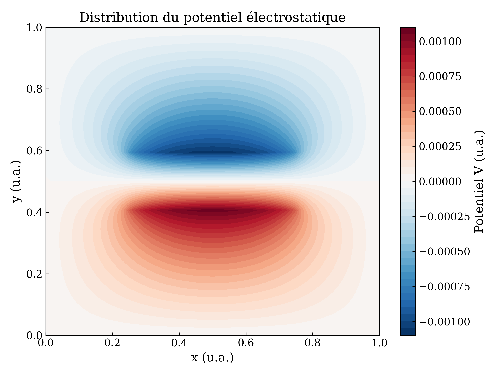
</p>

### Charge Distribution ρ(x,y) and Electric Field E = −∇V

<p align="center">
  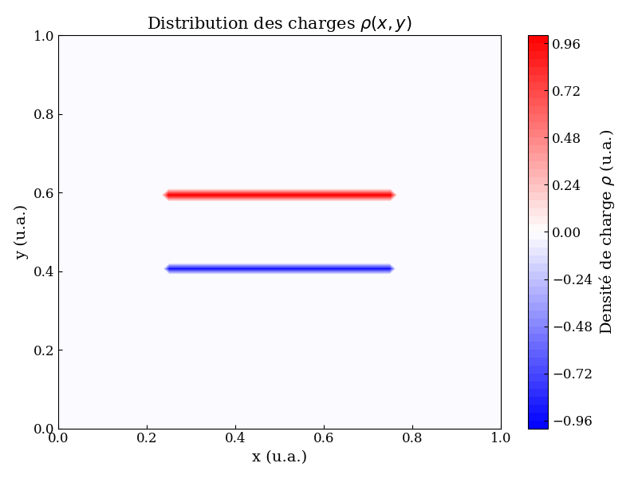
  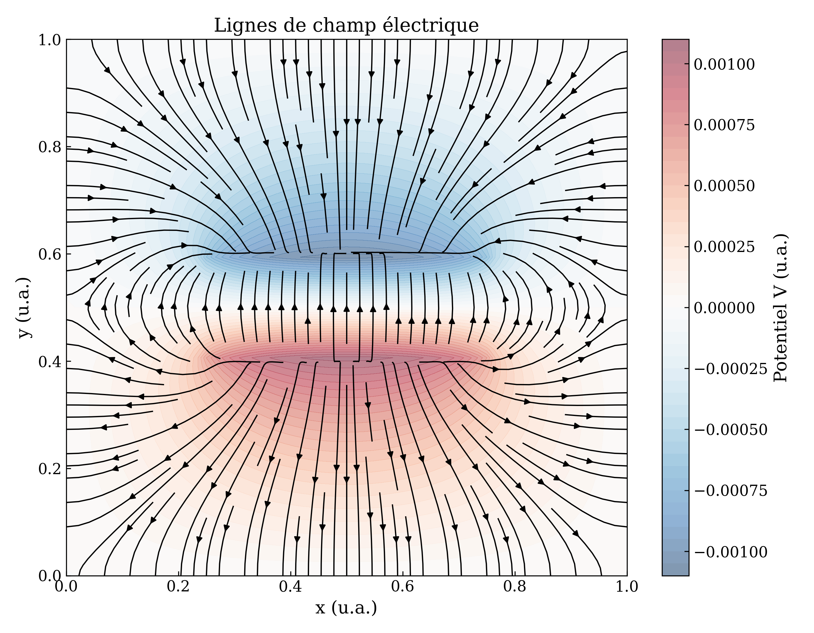
</p>

### Field Norm |E|

<p align="center">
  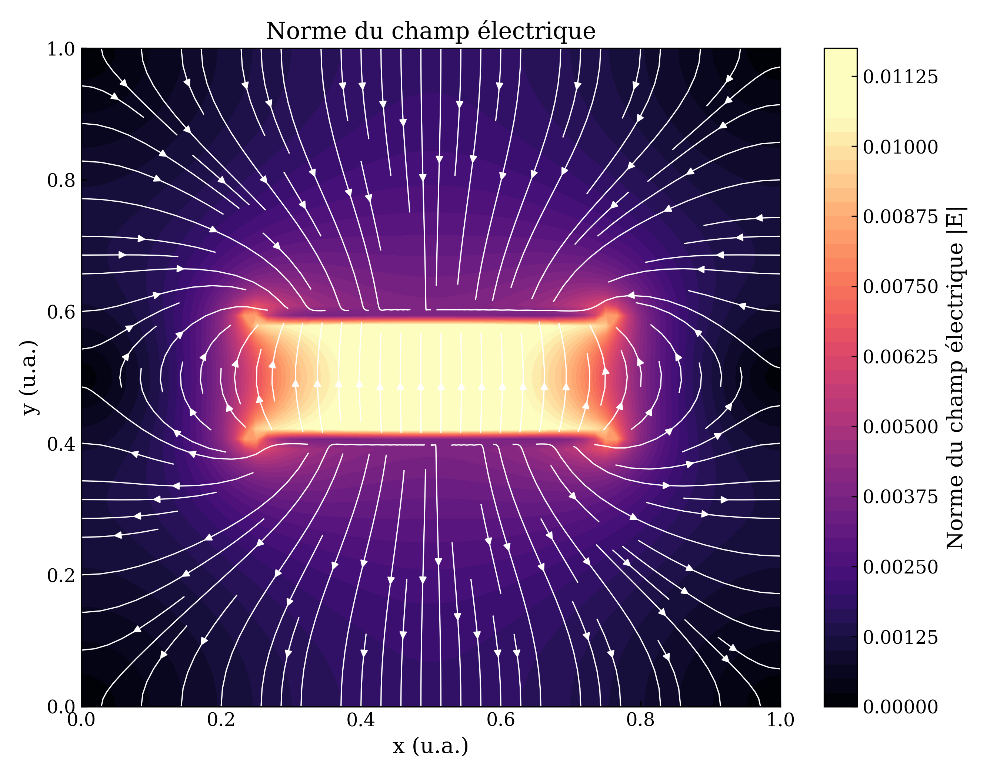
</p>

---

## Benchmarks

### Runtime vs. Grid Size N (log-log)

<p align="center">
  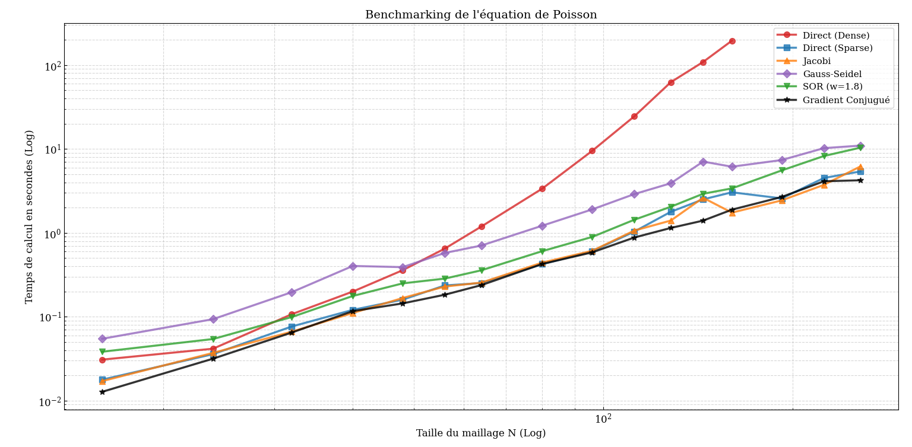
</p>

| Method | Type | Residual | Time (N=65) | Complexity |
|---|---|---|---|---|
| Dense (Gauss) | Direct | ~10⁻¹⁵ | 1.34 s | O(N⁶) |
| Sparse (spsolve) | Direct | ~10⁻¹⁵ | 0.38 s | O(N³) |
| Jacobi | Iterative | ~10⁻³ | 0.35 s | O(N⁴)* |
| Gauss-Seidel | Iterative | ~10⁻³ | 0.72 s | O(N⁴)* |
| SOR (ω*) | Iterative | ~10⁻³ | 0.32 s | O(N²·⁵) |
| Conjugate Gradient | Krylov | ~10⁻⁵ | 0.21 s | O(N²·⁵) |

*O(N⁴) = O(N²) iterations × O(N²) cost per sparse matrix-vector product.

### Precision vs. Grid Size N (log-log)

<p align="center">
  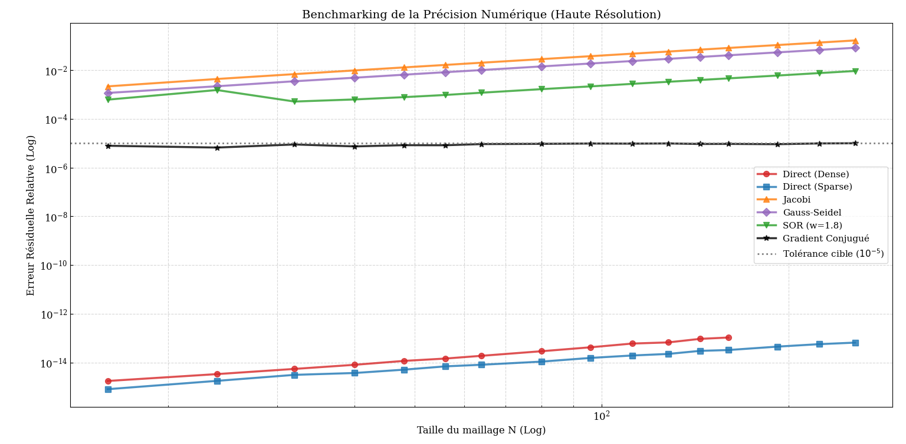
</p>

Direct methods achieve machine precision (~10⁻¹⁵). Iterative methods converge to their tolerance (10⁻⁵), sufficient for numerical physics and independent of N — a sign of discretization robustness.

---

## Iterative Convergence

<p align="center">
  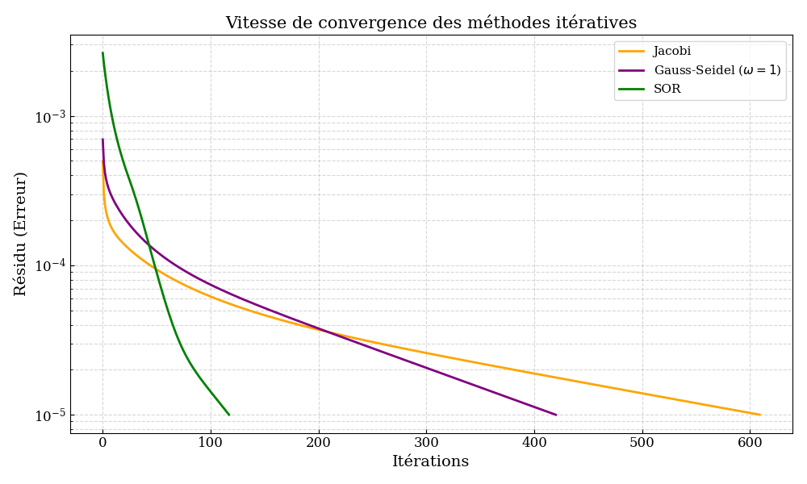
</p>

Convergence is linear in the asymptotic regime. SOR with optimal ω reduces the spectral radius from 1 − O(1/N) (Gauss-Seidel) to 1 − O(π/N), yielding an N/π speedup in iteration count.

---

## SOR Parameter Optimization

<p align="center">
  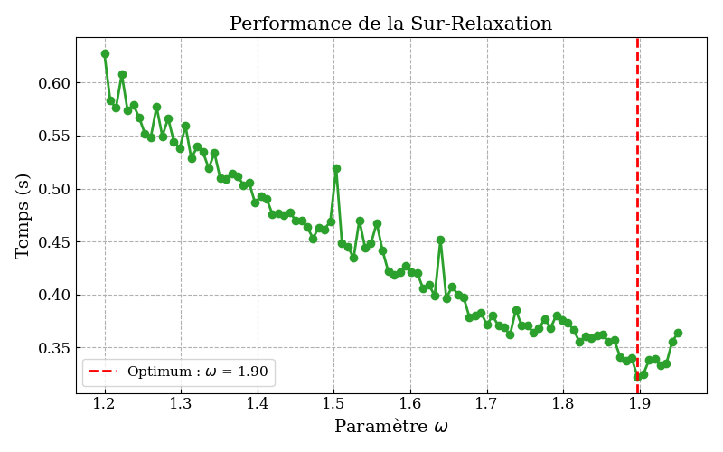
</p>

Empirical optimum: **ω* ≈ 1.90**, consistent with the theoretical value ω* = 2/(1 + sin(π/66)) ≈ 1.86.

---

## Spatial Error Analysis

<p align="center">
  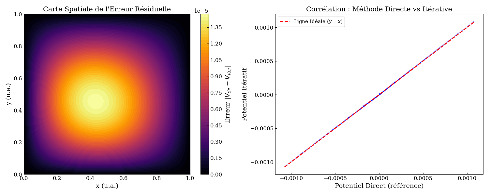
</p>

The absolute error map |V_direct − V_SOR| peaks near the charge sources. The near-perfect collinearity with y = x confirms the absence of systematic bias in the iterative solution.

---

## Heterogeneous Dielectric Extension

A dielectric block (ε_r = 50, typical of BaTiO₃ ceramic) is placed at x ∈ [0.1, 0.5], y ∈ [0.45, 0.55]. The matrix A is rebuilt using arithmetic averaging of ε_r at interfaces; the Conjugate Gradient solver handles the non-homogeneous case without modification.

<p align="center">
  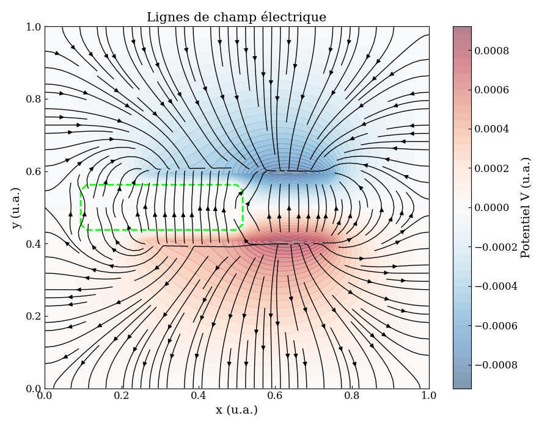
  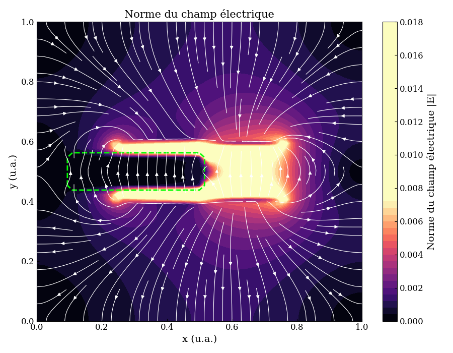
</p>

Three physical effects are observed: field line refraction at the interface, potential screening (|E| reduced by ~ε_r inside), and bound charge accumulation at permittivity gradients.

---

## Project Structure

```
poisson-2d-solver/
├── poisson.py        # Core solver: matrix construction + 6 algorithms
├── analysis.py       # Benchmarking, plotting, and analysis routines
├── main.py           # Interactive CLI entry point
├── figures/          # All generated plots
├── report/           # Full written report (PDF)
└── requirements.txt
```

## Installation

```bash
pip install -r requirements.txt
python main.py
```

## Requirements

- numpy
- scipy
- matplotlib
=======
# poisson-2d-solver
Finite-difference solver for the 2D Poisson equation in Python. Benchmarks six algorithms (Dense, Sparse, Jacobi, Gauss-Seidel, SOR, Conjugate Gradient) on runtime and precision. Includes SOR parameter optimization and extension to heterogeneous dielectric media.
>>>>>>> 2af4dd5a52767001ff59cd6873afeb1b353a778f
